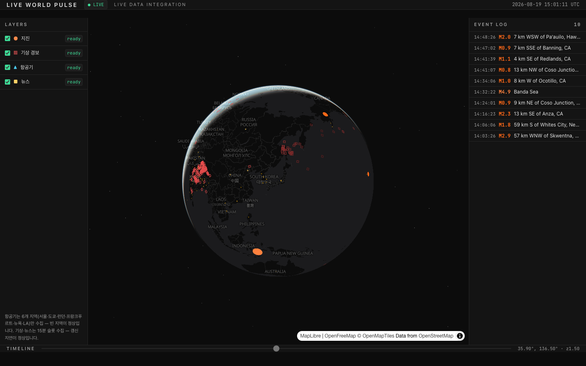

# Live World Pulse

> **Explore what's happening on Earth — across space and time.**

전 세계 실시간 이벤트(지진·항공기·기상·뉴스)를 하나의 3D 지구본 위에서 탐색하는 데이터 시각화 서비스.

**🌍 Live: https://live-world-pulse.pages.dev/world**



## 지금 동작하는 것

- **실시간 지진** — USGS 피드, 규모=크기·심각도=색 이중 인코딩, 최근 이벤트 펄스
- **실시간 항공기** — 6개 지역(서울·도쿄·런던·프랑크푸르트·뉴욕·LA) ADS-B, 방위각 회전 메시, 지역당 3분 해상도
- **이벤트 로그 패널** — 새 지진이 Network 탭처럼 흘러드는 리스트 (스크린리더 1급 뷰)
- **클릭 inspect** — 마커 클릭 → 속성 패널 (규모·깊이·고도·속도)
- **공유 가능한 URL** — 카메라·레이어·선택 상태가 전부 URL에 (`?lat=…&l=eq,fl&sel=…`)
- **정직한 상태 표시** — `● LIVE`는 "최신 가용 스냅샷"의 의미. 갱신이 끊기면 `◐ 지연 N분`으로 강등하고, 수집 갭은 숨기지 않고 표시

실측: 지진 + 항공기 1,400여 대 동시 렌더 @ 120fps (M5, 1440×900 기준. 렌더 한계는 별도 스파이크에서 30,000점 @ 120fps 검증 — [판정 기록](docs/spike/RESULT.md)).

## 아키텍처 — 월 $0 운영

```
USGS / adsb.lol ──→ Cloudflare Workers Cron (1분)
                         │  정규화 + 멱등 versioned 키
                         ▼
                    Cloudflare R2  (raw 7일 롤링 / norm 90일 롤링 / latest)
                         │  Worker 프록시 (ETag·immutable 캐시·rate limit)
                         ▼
                    React + MapLibre globe + deck.gl  (Cloudflare Pages)
```

- **DB 없음.** 시간 여행(Time Machine, 개발 중)은 DB 쿼리가 아니라 R2의 시간 버킷 파일을 읽는 방식 — egress 무료라 성립하는 설계
- **WebSocket 없음.** 가장 빠른 소스가 60초 주기라 순손실 — 폴링 + ETag 304로 충분하다는 판단을 [계획서 §8](docs/PLAN.md)에 논증
- **상주 서버 없음.** 수집기는 1분 cron Worker — 무료 한도 안에서 히스토리가 쌓인다

## 왜 이 프로젝트인가

흔한 "지도에 점 찍기"와의 차별점 두 가지에 집중한다:

1. **시간축** — 수집기가 지금 이 순간에도 히스토리를 쌓는 중. 타임라인으로 과거 세계 상태를 복원·재생하는 것이 다음 마일스톤
2. **정직한 데이터 엔지니어링** — 소스의 한계(커버리지 공백, rate limit, 사후 정정)를 숨기지 않고 UI 계약으로 만든다. 수집 갭은 회색 밴드, 커버리지 편차는 안내문, `revision`으로 USGS 규모 정정 추적

## 기술 결정 기록

주요 결정과 근거는 전부 문서화되어 있다:

| 문서 | 내용 |
|---|---|
| [docs/PLAN.md](docs/PLAN.md) | 마스터 계획 — 데이터 모델 3분기 계약, $0 저장 설계, 수용량 검산 |
| [docs/spike/RESULT.md](docs/spike/RESULT.md) | 렌더링 엔진 실측 판정 (maplibre globe + deck.gl overlaid 채택, interleaved 탈락 근거) |
| [docs/DESIGN.md](docs/DESIGN.md) | 다크 관제실 디자인 시스템 — WCAG AA 검증 팔레트, shape 이중 인코딩 |
| [docs/review/](docs/review/) | 계획 검토·데이터 소스 실측 리포트 |

## 로드맵

- [x] Phase 0 — 3D 지구본 + 지진·항공기 라이브 + 공개 배포
- [ ] Phase 1 — 기상 경보(WMO CAP·GDACS 태풍 트랙)·뉴스(GDELT) 레이어, 타임라인, 룰 기반 이벤트 상관
- [ ] Phase 2 — Time Machine: -24h 임의 시점 복원·재생

## 데이터 출처 & 라이선스

- 지진: [USGS Earthquake Hazards Program](https://earthquake.usgs.gov/) (Public Domain)
- 항공기: [ADSB.lol](https://adsb.lol) — [Open Database License (ODbL) v1.0](https://opendatacommons.org/licenses/odbl/1.0/)
- 지도: [MapLibre](https://maplibre.org/) · 타일 [OpenFreeMap](https://openfreemap.org/) © [OpenMapTiles](https://openmaptiles.org/) · 데이터 © [OpenStreetMap](https://www.openstreetmap.org/copyright) contributors
